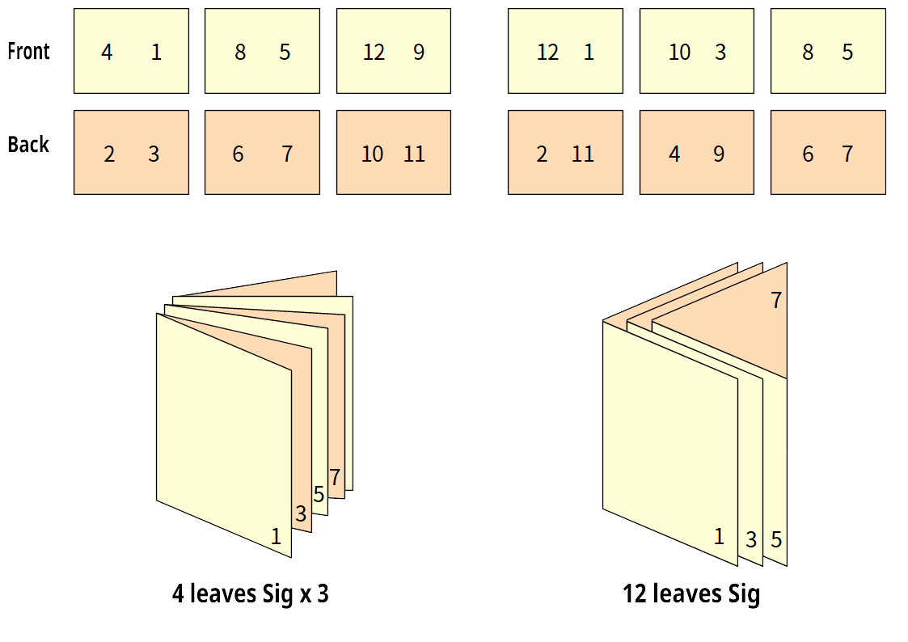
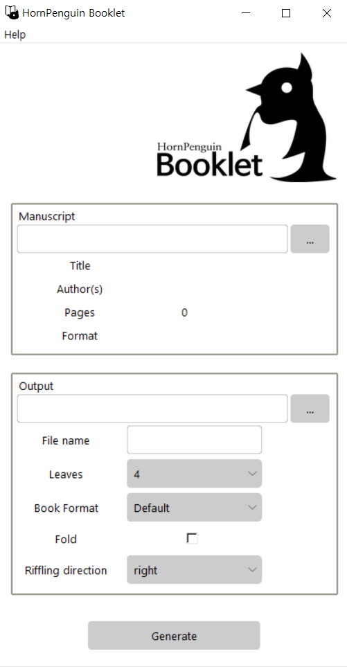

# HornPenguin Booklet


HornPenguin Booklet is a simple software that generates booklet and signature for bookbinding from your pdf files.
You can print your own book signatures and simple pamplet with your home printer.

* Support diffence signature size from 4 to 32.
* Change page size during generating signature.
* Left riffling direction is supported for old asian bookbinding.

Further routines for next version

* Fold signature supporting for special number of leaves (8, 16, 32).

## Layout of Signatures

<p align="center">
  
</p>

## UI and Usage

Version 0.0.1

Executable file is in `dist` directory with `HPBooklet.exe` name. It is complete itself. This is only useful for Windows user, however, I did not use any os dependent things. For OSX and Linux users, you can execute program with `main.py` script in `src` directory. Just check the prerequists in **Dependency** section.

Note: I used [pyinstaller](https://pyinstaller.org/en/stable/) to create executable file in Windows with `--onefile` option. It will be take some time at iniitial stage.

### Manuscript Frame

1. File selector: Choose original file.
2. Title, Author(s), Pages, Format: Automatically detect metadata of the selected pdf file. They will be remianed in generated signature or booklet file. 

### Output Frame

1. Output directory: Generated file location.
2. File name: Choose file name of output. Initial value is original file. 
3. Leaves: Number of leabes per signature. 'f' suffix means fold support number.
4. Book Format: Output page size. 'Default' value remains original size. See other ISO dimensions of format in 'Help' -> 'Format' above menu.
5. Fold: Option for fold signature. Pages will be rotated and rearranged for folding. (Not supported yet)
6. Riffling direction: Default is 'right' value. 'left' value is for an traditional asian bookbinding which riffles from right to left. 

<p align="center">
  
</p>


## Dependency

* Tkinter
* PyPDF2
* Pillow

Install them with next command

```
pip install PyPDF2 Pillow 
```

## License

This program distributed under BSD-3 license
See detail license text in "[LICENSE](LICENSE)" file in repository.
