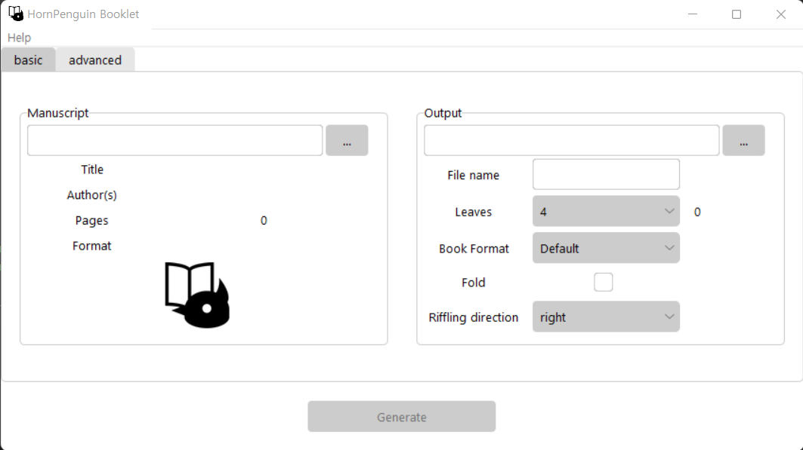

# HornPenguin Booklet

**Version** 0.0.1

<p align="center">
  
</p>

**HornPenguin Booklet** is a simple software generating booklet and signature for bookbinding from your pdf files.
You can print your own book signatures and simple pamplet with your home printer.

* Support diffence signature size from 4 to 32.
* Change page size during generating signature.
* Left riffling direction is supported for old asian bookbinding.
* Printing markers; trim, CMYK, signature proof, ... .

See further details and usage examples in project [documents](https://hpbooklet.readthedocs.io/en/latest/). 

## Layout of Signatures

Output pdf will be arranged as next image for 4, 12 leaves as F, B, F, B, ... order.

For example, 4 leaves per signature: 4, 1, 2, 3, 8, 5, 6, 7, 12, 9, 10, 11.

<p align="center">
  
</p>

Above image shows order of pages per each case of signatures: 4, 12 and how to fold and attaching each sheets. The right, 12 leaves sig, also can be combined with other signatures to form a book or it can be complete in itself as a pamplet.

## UI

## Quick Usage

### Execution

The executable files are in `dist` directory. 

There are two options *onefile* execution file and the compressed *onedir* file. The project supports for Windows, Linux, and OSX.
You must notice that the *onefile* files requires some time to execute at initial stage. To inform the executation, there is a splash window in the each *onefile* files, thanks to splash routine in [pyinstaller](https://pyinstaller.org/en/stable/).

* **Windows**

  ```
  Booklet.exe
  Booklet_Windows.zip
  ```

* **Linux**
  ```
  Booklet
  Booklet.tgz
  ```
* OSX

  No, but you can excute `main.py` with your python environment.

or you can directly execute `main.py` with your python environment. Just check the prerequists in **Dependencies** section.
It is recommended if there are some errors in the execution files or you are using OSX. (I don't have Mac yet.)


### Manuscript Frame

1. File selector: Choose original file.
2. Title, Author(s), Pages, Format: Automatically detect metadata of the selected pdf file. They will be remianed in generated signature or booklet file. 

### Output Frame

1. Output directory: Generated file location.
2. File name: Choose file name of output. Initial value is original file. 
3. Leaves: Number of leabes per signature. 'f' suffix means fold support number.
4. Book Format: Output page size. 'Default' value remains original size. See other ISO dimensions of format in 'Help' -> 'Format' above menu.
5. Fold: Option for fold signature. Pages will be rotated and rearranged for folding. (Not supported yet)
6. Riffling direction: Default is 'right' value. 'left' value is for an traditional asian bookbinding which riffles from right to left. 

<p align="center">
  
  
</p>


## Dependencies

* [reportlab](https://www.reportlab.com/)
* [PyPDF2](https://pypdf2.readthedocs.io/)
* [Pillow](https://pillow.readthedocs.io/en/stable/)
* [simpleaudio](https://simpleaudio.readthedocs.io/en/latest/)

Install them with next command

```
pip install PyPDF2 reportlab Pillow simpleaudio
```

For `simpleaudio`, it requires compilers, build tools and prerequest library `libasound2-dev` to install the module. 
If you are using Ubuntu you can install `build-essential` from repository.

```
sudo apt install build-essential libasound2-dev
```

## Further routines

Further routines for next version

**Simple**

* Add more color markers

**Little troublesome**

* Converting PDF with image before transformation.(some pdfs are broken in their fonts or positions of elements during transformation)

**Annoying**

1. Dealing multiple PDFs at once.
2. PDF preview for original and signature(UI.... :<).

## License

This program distributed under BSD-3 license
See detail license text in "[LICENSE](LICENSE)" file in repository.
