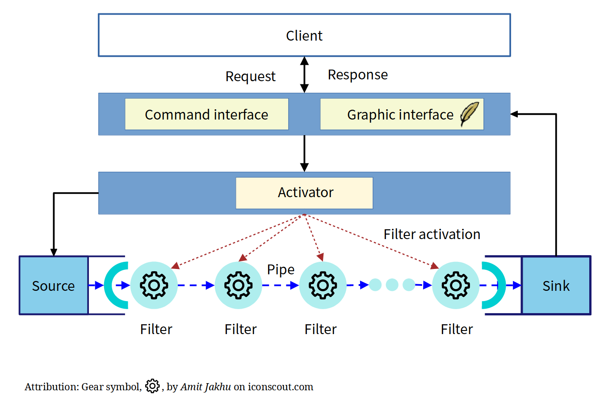

Developer Guide
=====================

Any contribution will be appreciated. You can participate in documentation, development of modifier, imporovement of UI.
providing example pdf or template. 

Language
---------------------

This project use `python <https://www.python.org/>`_

Documentation
---------------------

Structure of software
------------------------------

Basically, this project is a pipe-filter type structure. 

See details in :ref:`Structure <structure>` document about detailed implementation and examples. 

Contribution
--------------------------------

Any suggestion for this project, bug fixing, and reporting 
are welcomed.

Bug report
~~~~~~~~~~~

In bug report, setting that generated bugs and example pdf are helpful to analyze errors in code.
You can report a bug to `Github Issue tracker <https://github.com/HornPenguin/Booklet/issues>`_ on source repository.

Some bugs are generated from the other open source libraries that are used in the project.
In this case, the developer cannot fix directly, at least the developer will notice you about them. 

Code style
--------------

This project is using a code quality management software, `Black <https://black.readthedocs.io/en/stable/>`_.
Black is an uncompromising code formatter, developed by PSF (Python Software Foundation) who are developing python. 

Naming convention
~~~~~~~~~~~~~~~~~~~~~~~

* class name: Upper Letter 
* class object name : with hypen `_`
    
Example:
    
        printing_mark = PrintingMark()

* Internal methods:
   * :code:`__get` : Get a specific type data

inside routine
~~~~~~~~~~~~~~~~

prefix

* :code:`__get` : Get a specific type data
* :code:`__check` : Check the given variable(s) and return boolean value :code:`True/False`.
* :code:`__validate` : Check the given variable(s) and raise error if the given values are not fit with condition.

License
--------------

When you import some works from the other authors, please
read "Terms of Use" or "License" sections of those projects in detail.

They can even make detailed difference for each type of usages. 
For example, the owner of project can restrict you to do next things 
whether permits or prevents with specific conditions.

* Directly including whole or partial source codes to other project
* Linking to other software 
* Redistribution including source, compiled static or dynamic library 
* Modifying api or whole sources ... et cetera.
  
Before you import external libraries or source codes, 
you must make sure that those licenses are compatible 
with works that you are trying. 
If your work is not compatible with them you must not use (including modification) them.
You can check a re-licensing term in their license description, find alternative sources, or implement their routines from ground state.
If they did not mentioned about usage you are trying, you must not think these are taken as implicitly allowed.
All the works of authors  

Below documents will be helpful to get basic informations.

* `Software License <https://en.wikipedia.org/wiki/Software_license>`_
* `Copyright <https://en.wikipedia.org/wiki/Copyright>`_
* `Copyleft <https://www.gnu.org/copyleft/>`_
* `The Open Source Way- GuideBook <https://www.theopensourceway.org/the_open_source_way-guidebook-2.0.html>`_
* `GNU essays and articles <https://www.gnu.org/philosophy/essays-and-articles.html>`_ : It is considered little old in modern opensource community but thses are ground philosophy of inital era of open source world.

These project is distributed with BSD 3-clause license. See :ref:`License <license>` document.

