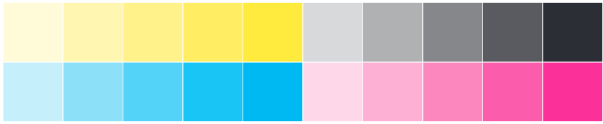
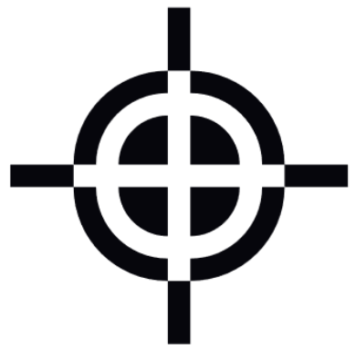

Printing Marker
=========================

Printing marks are indicators of printing quality and a guide of manufacturing process.

Registration and Color bar
----------------------------

Basically, color implementation is a mixture of basis colors. 
In addition, printing result is hardly relying on its quality of implementation.
There are various properties to determine the quality of printing. 

Every colors can be represented with sum of basis colors.
There are two basis in color system, RGB(Red, Green, Blue), and CMYK(Cyan, Magenta, Yellow, Key:black).
RGB color system is used in light mixing and it is a basic system of nature, in color sensing of animals neuron.
CMYK is a system that used in printing with mixture of inks.

RGB system is getting brighter than primary colors and CMYK is getting darker than primary colors.

**Mixing mapping of colors**

RGB system 

* R + G + B = White
* R + G = Yellow 
* R + B = Magenta 
* G + B = Cyan 
* None = Black       

CMYK system

* C + M + Y = Registration black
* C + M = Blue
* C + Y = Green
* M + Y = Red
* K = Black
* None = White

Since, the quality of basis color printing is a charateristic property of printing device 
In common situation, printing devices spread inks on surface with independent spread system by colors.
Therefore, if we want to check the quality of color and identify the error, we must check all basis colors.

* Dense uniformity of basis color - color bar
* Mixed color representation - color bar
* Registration of printing heads - registration marker

Various types exist in color bar for printing marker, but matrix of color square is a common type.

Color bar
^^^^^^^^^^^^^

HornPenguin Booklet provides two types of color bars. One is for checking basis color dense and the other is for mixed coloe representation.
Primary type is composed of 20%, 40%, 60%, 80%, 100% dense of each color, total 20 square.
Last one is composed of 100% color mixture of CMY colors. It is a transform to 1d list of color van-diagram.

Location of color bar is determined by the pagesize of manuscript.
The program chooses larger area of margin betweeen horizontal and vertical margin.
Its shape is 2x10, or 1x20 matrix. In the given area, the program find a dimension that makes larger square.

Registration Black and Marker
^^^^^^^^^^^^^^^^^^^^^^^^^^^^^^^^^^^^^^^

It will be weird that Key color is in CMYK color, because we can make black color by mixing C, M, Y inks.
However, such black does not dark as much we expected and it is a waste of inks, since the most frequently used color in printing is a black.
Therefore, additional black ink is used as a name of 'Key'.
Still, CMY black is used in printing not for printing cotents but as a marker.
It is called 'registration black'. See a color vector to identify the difference.

* Black(Key): ( 0, 0, 0, 1)
* Registration Black: (1, 1, 1, 0)

In prinitng device, registration black is implemented by spread all cmyk ink on such area.
It is useful to see registration of color spread system in device.
Usually, cross symbol is used as registration marker. 
If they are not registered properly, there will be some color edges on symbol.

Example
-----------

Implementation
-----------------

Further readings
--------------------

.. 
    .. autoclass:: booklet.core.templates.printingmark.PrintingMark
   