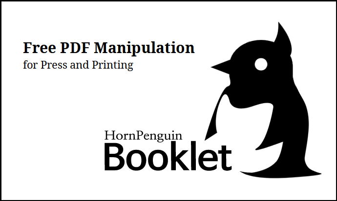

.. HornPenguin Booklet documentation master file, created by
   sphinx-quickstart on Sun Jul 10 15:39:22 2022.
   You can adapt this file completely to your liking, but it should at least
   contain the root `toctree` directive.

HornPenguin Booklet
===============================================

HornPenguin Booklet is a free and open source booklet generating program. 
It can reorder the pages, rotate and transform for fold signature, 
and add printing markers for color printing.

You can print your book signatures and a simple pamphlet with your home printer.

* Support difference signature size from 4 to 64.
* Change page size during generating a signature.
* Left riffling direction is supported for old Asian, Hebrew, and Arabic bookbindings.
* Printing markers: trim, CMYK, signature proofs are supported.

.. toctree::
   :maxdepth: 1
   :caption: User Guide

   user/installation
   user/usage
   user/terms
   user/license
   user/about
   

Indices and tables
==================

* :ref:`genindex`
* :ref:`modindex`
* :ref:`search`
