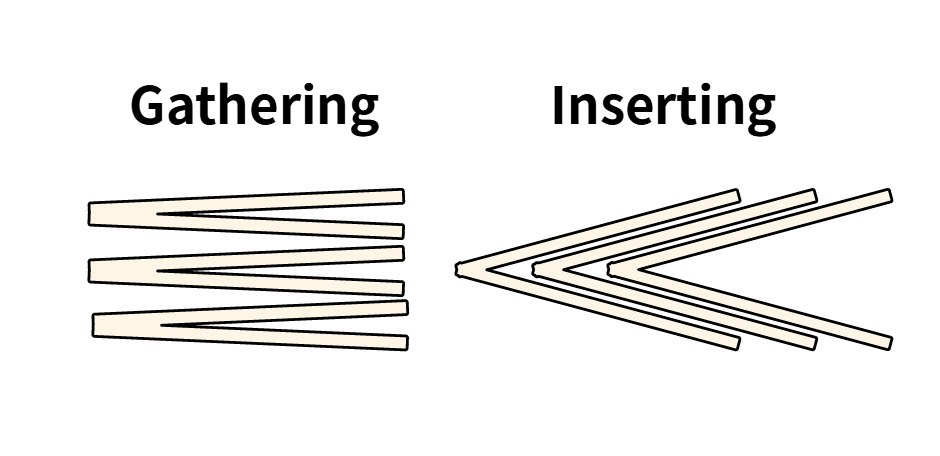
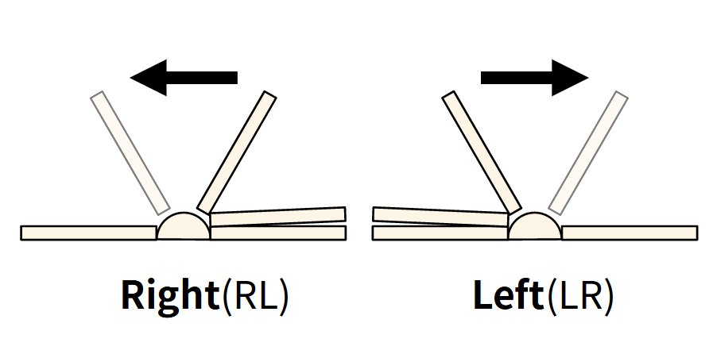
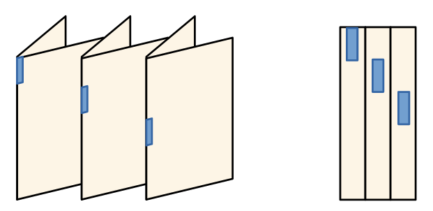

============================
Terms of Book and Printing
============================

This document describes about basic expressions of printing and press and their introductions.

Shape and Structure of Book
==================================

Signature
-----------

The **signature** is a contents block of book, pamplet or booklet. 
That is, *a group of sheets* not seperated by its contents, but prefixed number of sheets. 
There are some synonyms, **section**, and **gathering**. This document will use **signature**.

Pages compose signature and the signatures compose book, booklet, ..., et cetera.
Single page can become a signature and single singnature can compose single book or booklet, (usually booklet).

Signature composition
^^^^^^^^^^^^^^^^^^^^^^^^^
As wrote the above, signature is governed by its number of sheets. 
Single paper signature is a :math:`2` sheets signature with dual side printing.
The number of sheets of signature must be a multiple of :math:`4`, practically considering *fold*.
Therefore, permitted numbers are :math:`4, 8, 16, 32, 64` and :math:`12, 24`.
:math:`12, 24` signatures are differ in its fold progress with :math:`4, 8, 16, 32, 64`.
Bigger sheets can be used :math:`>64` to make single signature, but it is not practical.

There are two types of methods to combine signatures, 
**inserting** and **gathering**. They are same after cutting the edges, but its order of pages are differ by types.
The *gathering* does not affect to order of each siganature but *inserting* does to match the correct ordering of pages. 

The :math:`n` sheets signature is composed of :math:`i` time inserted :math:`f` sheets signature.

.. math:: 
    n = i \times f.

If :math:`i = 1`, the signautre is an uninserted fold signature. 

For example, :math:`16` sheets signature has next variation.

* :math:`1 \times 16`
* :math:`2 \times 8`
* :math:`4 \times 4`

See graphical examples.

Riffle direction
--------------------

**Riffle direction** is a direction of riffling while you read contents of book.
It depends on reading direction of language. The most common direction is a horizontal, from left top to right bottom(HLTRB) direction.
There were various reading direction by the language system. Most of them are not used in recent era, but from left to right reading direction
frequently used in many situations more than the people think. 

Belows are uncommon example languages in reading direction.

* Old asian: East asians used VRTLB(vertical, from right top to left bottom) system. 
    Now, vertical writing is rarely seem in modern texts in asia (it is differ by the countries), but as a design or a research works, they are still adopted in many works.
    For example, some Japan mangas using vertical writing in their speech bubbles. There is a good different point in speech bubble by the writing direction in Japan and Korea. 
    Japan's speech bubbles are vertically long while the Korea's are horizontally long. 
    Korea also use vertical writing sometimes but not as popular as Japan. This difference are affecting to their speech bubble shape in comics.
    It is one example that how the curtural difference, in case writing direction, are visually expressed.
* Hebrew and Arabic: RL system
* Ancient Egyt: Very special they used both direction LR and RL. The same characters can written symmetrically by the direction.
* Elder Island script, Ogham scripts: It also has an abnormal direction. Its direction is vertically from bottom to top.

From top to bottom, or from bottom to top are not affected by the order of pages.
However, whether the reading direction is LR or RL affects the page ordering considering reading efficiency.

The default setting of HornPenguin Booklet is a LR direction and support *RL*.

Supporting *RL* is not complicate. Just reverse order the pages before applying rearrange transformation to the pages.

Imposition
-------------

The imposition means a locating works of pages to paper and the result of those works.
Unless you binding book in old Asia style (their method can use single paper as basic signature) , 
you must print signature considering fold action.
This is why the manuscript for book should have a number of pages which is a multiple of 4.

Imposition layout update
^^^^^^^^^^^^^^^^^^^^^^^^^^^

It will be worth to describe folding layout update process.

* :math:`n` sheets signature contains :math:`n` number of pages.
* Imposition of :math:`n` sheets signatures are divided into two sections, the front page and the back page.

This process covers next signatures.

.. math:: 

    a_0 = 4 \\\\

    a_n = 2 \cdot a_{n-1}

Let's start from :math:`4` sheets signature, its page layout is a :math:`(1,2)`.

Front page: :math:`[4, 1]`

Back page: :math:`[2, 3]`

from these two matrix, we will get page imposition of :math:`8` sheets signature.

Imagine the folding process of :math:`4` sheets signature to make :math:`8` sheets signature.
We rotate 90 degree and split them into :math:`2` sub sections.
Interesting point is that, the :math:`k`-th page of :math:`n+1` sheets signature always exists in :math:`k`-th page of :math:`n` sheets signature, :math:`1 \leq k \leq n`.
In addition, the two pages, :math:`a, b`, seperated by the creasing line have next relationship, :math:`a+b = n-+1`. 

These are all we need. The remains are just following them.

Rotating
~~~~~~~~~

Rotating elements of matrix can be divided into two steps, transpose and flip.
Rotating the elements of 90 degree in counter-clockwise direction,

*Transpose*:

.. math:: 

    [4, 1] \rightarrow \begin{bmatrix} 4 \\ 1 \end{bmatrix}

*Flip*:

.. math:: 

    \begin{bmatrix} 4 \\ 1 \end{bmatrix} \rightarrow \begin{bmatrix} 1 \\ 4 \end{bmatrix}

Expanding
~~~~~~~~~~~

Now expand each line using :math:`a+b = n+1`.
Bascially, in single number case, additional number is left of the previous number. 

.. math:: 

    8 = 8 + 1 -1, [1] \rightarrow [8 ,1] \\\\

    5 = 8 +1 -4,  [4] \rightarrow [5, 4]

Then, we get a front layout matrix of the :math:`8` sheets signature.
In the same way, let's get a front layout matrix of the :math:`16` sheets signature.

*Rotating*:

.. math:: 

    \begin{bmatrix}
        8, 1 \\
        5, 4
    \end{bmatrix} \rightarrow 
    \begin{bmatrix}
        1, 4 \\
        8, 5
    \begin{bmatrix}

*Expanding*:

.. note:: 

    There is a little different in :math:`n>4` case. 
    In expanding steps, you must divide one row numbers into sub groups whose length is :math:`2`.
    The prior one is same with :math:`n=4` case but the second number is remained at right in expanding progress.
    For example, if we have :math:`[13, 12, 4, 5, 1, 8, ...]` row then, :math:`[[13, 12], [4, 5], [1, 8], ...]` and expand them.

.. math:: 

    [1,4] \rightarrow [[16 ,1],[4, 13]]\\\\

    [8, 5] \rightarrow [[9, 8], [5, 12]]

See update steps of front matrix:

.. math:: 

    [4, 1] \rightarrow 
    \begin{bmatrix} 
        8, 1 \\
        5, 4
    \end{bmarix} \rightarrow 
    \begin{bmatrix} 
        16, 1, 4, 13 \\
        9, 8, 5, 12
    \end{bmarix}

Rotating Page
------------------

Imposition work includes folding work. 
That is, pages must be roated in right direction to match a direction of each pages after fold. 
In imposition layout, it is simple. Just rotating :math:`2, 4, 6, ..., 2k, ...` rows of 180 degree.

Printing markers
================================

Signature proof
-----------------

**Signature proof** is a ordering proof makrer on spine of signatures. It helps for people to arrange the signatures in right order
and check missing signatures.

Trim marker
-----------------

Trim location indicator.

Registration marker
-----------------------

Registration marker is added to check the registration of color printing of printing machine. 
It's color looks like normal black color (CMYK(0, 0, 0, 100)) but actually it is a special color called
*registration black*, CMYK code is (100, 100, 100, 0). If they are perpectly fitted, it will look like normal black color.

