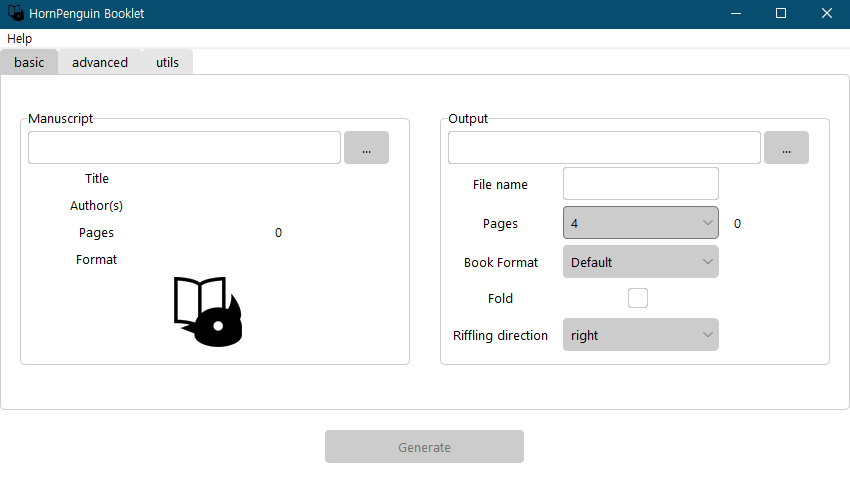
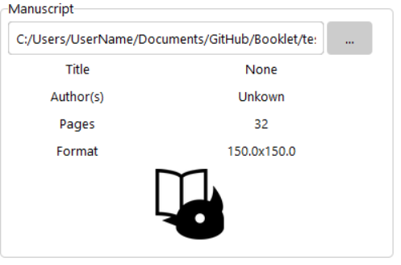
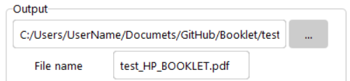
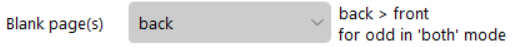
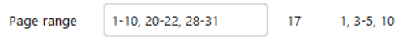
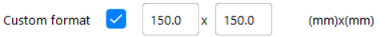
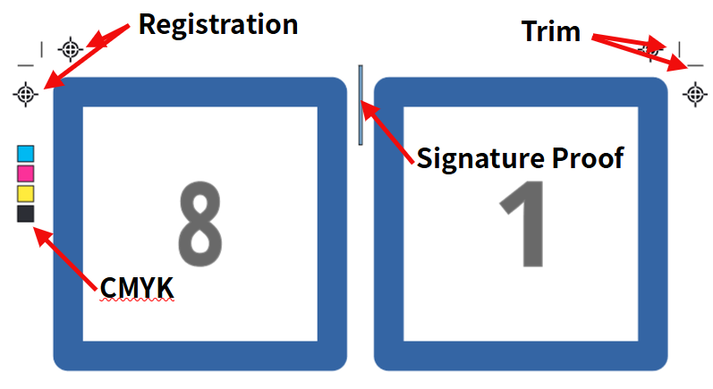
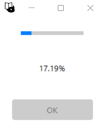

.. _usage_label:

Usage
===============

Basic
------------

UI

Select PDF file to modulate
^^^^^^^^^^^^^^^^^^^^^^^^^^^^^^

.. image:: ../_static/select_file001.png

Click the grey button with :code:`...` notation on right of intputbox to choose manuscript.
Otherwise, you can type file path directly to input box including file name, but it is not recommended. 

In this example, we chose :code:`test.pdf` file. 
HornPenguin Booklet automatically detects meta datas, title, authors, and pages, of the given pdf files.
In cui, just typing path of selected pdf file.

Basic Settings
^^^^^^^^^^^^^^^^

Output path and File name
~~~~~~~~~~~~~~~~~~~~~~~~~~~~~

*Output path* is a directory path that output file will be saved, Default value is the path of original file.
You can modify it with clicking grey button, :code:`...`, or directly modify path string in inputbox.

*File name* is a name of output file. Default value is :code:`{original file name}_HP_BOOKLET.pdf`. 
You can modify it, but beaware that it does not check existence of given file. 
If there is same file in output path, it will be overwritten by the new file. 

Leaves
~~~~~~~~~

.. image:: ../_static/output_setting002.png

*Leaves* is a number of sheets per each signatures. 
When you choose specific number of sheets, additional blank pages will be shown right to selection box.
In this case, manuscript file has 32 pages, so it will be 0 for 4, 8, 16, 32 number of sheets.
In the list of sheet numbers, you can see some numbers have a subfix :code:`f`.
:code:`f` indicates fold support numbers. if you select one of those numbers, the fold check will be activated.

Book format
~~~~~~~~~~~~~~

.. image:: ../_static/output_setting003.png

*Book Format* is a page dimension of output file. 
Default value conserves the original page size. 

.. list-table:: 
    :align: center

    * - .. image:: ../_static/help.png
      - .. image:: ../_static/paperformat.png

See dimension(mm) in above `Help` -> `Paper Format` reference.

Fold
~~~~~~~~~~

.. image:: ../_static/output_setting004.png

*Fold* option is restricted to some special sheet numbers in *Leaves* and they are notated :code:`{number}f`.
The defualt transformation does not rotating pages for fold. 
Check this option, if you want to get direct result to fold.
It is automatically checked when you check *imposition* option in advanced tab. 

Riffling direction
~~~~~~~~~~~~~~~~~~~~

*Riffling direction* is a riffling direction of output file. 
Default: `right`. `left` is for old Asian, Arabic, and Hebrew manuscript.

 
Advanced options
--------------------

.. image:: ../_static/advanced_ui.png

Click the above `advanced` tab to see advanced settings.
Basic settings are using prefixed advanced settings. 
You can modify more detailed options.

Sheet works
^^^^^^^^^^^^^

Blank page(s)
~~~~~~~~~~~~~~~

*Blank page(s)* option sets mode of blank page. 
This mode indicates the location where the additional blank pages are added. 
Supported options are :code:`back`, :code:`front`, :code:`both`. 
When you choose :code:`both` option, the additional pages will be distributed equally front and back.
If the additional pages are odd, then back pages will be prior than front.
Default is `back`.

Page range
~~~~~~~~~~~~

.. image:: ../_static/Page_range001.png

*Page range* is a range of pages to use in transformation. 
You can use selected pages of orginal file to generate signature. 
You can combine independent single pages and several page ranges with comma, :code:`,`. 
Example: :code:`1-20, 23, 25, 40-100`. 
The total pages in page range will be calulated and shown next to input box. 
Beaware that if the given range string is not vaild (pages must be in right order and must not exceed max page range) , it will deactivate `Generate` button below. 
Default is :code:`1-{total pages of original file}`.

Let's see an example, the above image shows the default range of :code:`test.pdf`, because its total range is from 1 to 32.
You can set specific range like below.

See the right of inputbox. It was updated by change of input range.

If range is not vaild, you can see next, the example box changes its background color red and :code:`Generate`` button is deactivated.

.. list-table:: 

    * - .. image:: ../_static/Page_range003.png
      - .. image:: ../_static/Page_range004.png

Custom format
~~~~~~~~~~~~~~~

You can set custom paper format that does not listed in `Paper format` table. 
The front is width and the back is height of format.
Default value is original paper size or predefined paper format in basic options.
See paper format reference in :code:`Help -> Paper Format` popup. 

Signature composition
~~~~~~~~~~~~~~~~~~~~~~~~~

.. image:: ../_static/sig_compose001.png

You can set number of inserting per given number of sheets in signature. 
You can change the number of inserting. 
Default value 1 and there are different options that make the number of sheets a multiple of 4.

In above case, 32 sheets, if you choose 4, then,

.. image:: ../_static/sig_compose002.png
 

Imposition
~~~~~~~~~~~~~~~

Pages located in same pages in printing are merged to single page. 
Single signatures will be composed of two sequential pages in output file.
This option activate *fold* option in basic tab.

Split
~~~~~~~

Save the output file with sepration by each signatures.

Printing markers
^^^^^^^^^^^^^^^^^^

This options add printing markers to output file.
Additional 

* Signature proof: Add color proofs to each signatures. Their vertical locations are different by order of signature. You can easily check missing or misordered signatures in combining state.
* Trim: Add trim markers indicate trim lines.
* Registration: Add cross registration black markers to left, right, top, bottom side. It color is *registration black*.
* CMYK: Add square Cyan, Magenta, Yellow, Key(black) color markers to left side.

Generation
--------------

.. image:: ../_static/generate_button.png

Click `Generation` button, progress popup windows will appear and *ping* sound will notice the job finished.

Command line
-------------

Same with gui method, but all those options are passed by argument.

.. code-block::

    usage: booklet [-h] [--version] [--format-help] [-i INPUT] [-o OUTPUT] [-n NAME] [--page-range [PAGE_RANGE ...]]
               [--blank-mode {back,front,both}] [--sig-composition SIG_COMPOSITION SIG_COMPOSITION]
               [--riffle-direction {right,left}] [--fold]
               [--format {Default,A3,A4,A5,B3,B4,B5,B6,JIS B3,JIS B4,JIS B5,JIS B6,Letter,Legal,Tabloid,GOV Letter,GOV Legal,ANSI A,ANSI B,ARCH A,ARCH B} | --custom-format CUSTOM_FORMAT CUSTOM_FORMAT]
               [--imposition] [--split] [--trim] [-reg] [--cmyk] [--sigproof [SIGPROOF]] [-y]
               [inputfile] [outputpath]

For example, if we transform the given pdf `input.pdf` to `signature.pdf` with 16 sheets signature composed of 4 sheets subsignature, marking signature proof to brown (hexcode = `#964B00`),

.. code-block::

    booklet input.pdf signature.pdf -sig-composition 4 4 --sigproof #964B00
