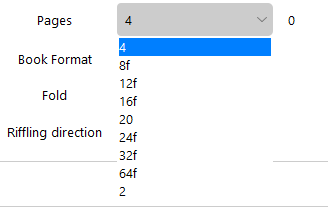
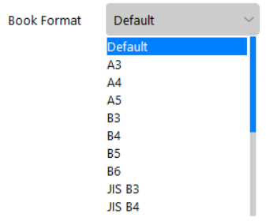
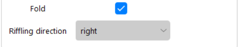
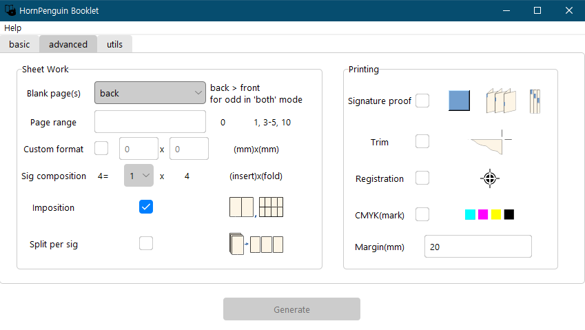
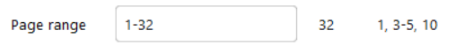
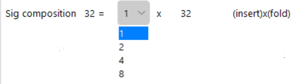

Usage
===============

.. _usage_label:

Basic
------------

UI

.. image:: ../_static/basic_ui.png

Select PDF file to modulate
^^^^^^^^^^^^^^^^^^^^^^^^^^^^^^

.. image:: ../_static/select_file001.png

Click the grey button with :code:`...` notation on the right of the input box to choose a manuscript.
Otherwise, you can type the file path directly to the input box including the file name, but it is not recommended. 

.. image:: ../_static/select_file002.png

In this example, we chose :code:`test.pdf` file. 
HornPenguin Booklet automatically detects meta data, title, authors, and pages, of the given pdf files.
In CUI mode, just type the path of the selected pdf file.

Basic Settings
^^^^^^^^^^^^^^^^

Output path and File name
"""""""""""""""""""""""""""""

.. image:: ../_static/output_setting001.png

*Output path* is a directory path where the output file will be saved, 
The default value is the path of the original file.
You can modify it by clicking the grey button, :code:`...`, or directly modify the path string in the input box.

*File name* is the name of the output file. The default value is :code:`{original file name}_HP_BOOKLET.pdf`. 
You can modify it, but be aware that it does not check the existence of the given file. 
If there is a same file in the output path, it will be overwritten by the new file. 

Leaves
""""""""""""""""""

*Leaves* is a number of sheets per each signatures. 
When you choose specific number of sheets, additional blank pages will be shown right to selection box.
In this case, manuscript file has 32 pages, so it will be 0 for 4, 8, 16, 32 number of sheets.
In the list of sheet numbers, you can see some numbers have a subfix :code:`f`.
:code:`f` indicates fold support numbers. if you select one of those numbers, the fold check will be activated.

Book format
""""""""""""""""""""""""""""

*Book Format* is a page dimension of the output file. 
The default value conserves the original page size. 

.. list-table:: 
    :align: center

    * - .. image:: ../_static/help.png
      - .. image:: ../_static/PaperFormat.png

See dimension(mm) in above `Help` -> `Paper Format` reference.

Fold
""""""""""""""""""""

*Fold* option is restricted to some special sheet numbers in *Leaves* and they are notated :code:`{number}f`.
The default transformation does not rotate pages for the fold. 
Check this option, if you want to get a direct result file to fold.
It is automatically checked when you check *imposition* option in the advanced tab. 

Riffling direction
""""""""""""""""""""""""""""""""""""""""

*Riffling direction* is a riffling direction of the output file. 
The default: `right`. `left` is for old Asian, Arabic, and Hebrew manuscripts.

 
Advanced options
--------------------

Click the above `advanced` tab to see advanced settings.
Basic settings are using prefixed advanced settings. 
You can modify more detailed options.

Sheet works
^^^^^^^^^^^^^

Blank page(s)
""""""""""""""""""""""""""""""

.. image:: ../_static/Blank.png

*Blank page(s)* option sets the mode of blank page addition. 
This mode indicates the location where the additional blank pages are added. 
Supported options are :code:`back`, :code:`front`, :code:`both`. 
When you choose :code:`both` option, the additional pages will be distributed equally front and back.
If the additional pages are odd, then the back pages will be prior to the front.
The default is `back`.

Page range
""""""""""""""""""""""""

*Page range* is a range of pages to use in transformation. 
You can use selected pages of orginal file to generate signature. 
You can combine independent single pages and several page ranges with comma, :code:`,`. 
Example: :code:`1-20, 23, 25, 40-100`. 
The total pages in page range will be calulated and shown next to input box. 
Beaware that if the given range string is not vaild (pages must be in right order and must not exceed max page range) , it will deactivate `Generate` button below. 
The default is :code:`1-{total pages of original file}`.

Let's see an example, the above image shows the default range of :code:`test.pdf`, because its total range is from 1 to 32.
You can set specific range like below.

.. image:: ../_static/Page_range002.png

See the right of the input box. It was updated by a change of input range.

If the range is not valid, you can see next, that the example box changes its background color to red and :code:`Generate`` button is deactivated.

.. list-table:: 

    * - .. image:: ../_static/Page_range003.png
      - .. image:: ../_static/Page_range004.png

Custom format
""""""""""""""""""""""""""""""

.. image:: ../_static/custom_format.png

You can set a custom paper format that is not listed in `Paper format` table. 
The front is the width and the back is the height of the format.
The default value is the original paper size or predefined paper format in basic options.
See paper format reference in :code:`Help -> Paper Format` popup. 

Signature composition
""""""""""""""""""""""""""""""""""""""""""""""""""

You can set a number of inserting per given number of sheets in signature. 
The number of inserts you can choose will be presented in list box. 
The default value is 1 and there are different options that make the number of sheets a multiple of 4.

In above case, 32 sheets, if you choose 4, then,

.. image:: ../_static/sig_compose002.png
 

Imposition
""""""""""""""""""""""""""""""

Pages located in same pages in printing are merged to single page. 
Single signatures will be composed of two sequential pages in output file.
This option activate *fold* option in basic tab.

Split
""""""""""""""

Save the output file with separation by each signature.

Printing markers
^^^^^^^^^^^^^^^^^^

This options add printing markers to output file.
Additional 

.. image:: ../_static/printing_markers.png

* Signature proof: Add color proofs to each signatures. Their vertical locations are different by order of signature. You can easily check missing or misordered signatures in combining state.
* Trim: Add trim markers indicate trim lines.
* Registration: Add cross registration black markers to left, right, top, bottom side. It color is *registration black*.
* CMYK: Add square Cyan, Magenta, Yellow, Key(black) color markers to left side.

Generation
--------------

Click `Generation` button, progress will be run in behind and program will be deactivated during working.

.. note::
    
    "progress popup windows will appear and *ping* sound will notice the job finished. "

    Update progress bar routine is in being developed to match with modified current structure.

.. image:: ../_static/Progress.png

Utils
------------

This tab supports miscellaneous utils; note mode, conversion to image, and custom imposition.
Note mode is in developing state, it will not work in 0.0.2 version.

.. 

  Note mode
  """"""""""""""""""""""""""
  
  This routine is presented for note maker. 
  However, :code:`basic, advanced` routines don't repeat the given pdf pages so you need to expand them using addtional program.
  
  This mode expands the given pdf to note type manuscript.
  For instance, below tutorial shows making process of laboratory note.
  The template is presented in template directory on project root directory. 
  
  Basic usage is just enable the note mode and enter a total number of pages of note.
  In this tutorial, HP Booklet will generate 200 pages note.
  
  .. 
    .. image::
    
  Some notes need page numbering, expecially laboratory note.
  As like note mode, you can disable or enable the numbering routine.
  It allows you to set next options.
  
  * Location: Header/Footer
  * Align: Left/Center/right
  * Count: Even/Odd/Both/Even only/Odd only
  
  The count options may be confuse if you see at first. 
  This represent the counted pages and number indicated pages.
  
  Even: count full pages and indicate it only on even pages.
  Even(only): count only even pages and indicate it only on even pages.
  
  It will be enough to show an example.
  
  .. 
    .. image:: 
    

Command line
-------------

Same with gui method, but all those options are passed by argument and it needs :code:`--console` option for console mode.
Without :code:`--console` option, it will start gui mode.

.. code-block::

    usage: booklet [-h] [--version] [--format-help] [--console] [-i INPUT] [-o OUTPUT] [-n NAME] [--page-range [PAGE_RANGE ...]]
               [--blank-mode {back,front,both}] [--sig-composition SIG_COMPOSITION SIG_COMPOSITION]
               [--riffle-direction {right,left}] [--fold]
               [--format {The default,A3,A4,A5,B3,B4,B5,B6,JIS B3,JIS B4,JIS B5,JIS B6,Letter,Legal,Tabloid,GOV Letter,GOV Legal,ANSI A,ANSI B,ARCH A,ARCH B} | --custom-format CUSTOM_FORMAT CUSTOM_FORMAT]
               [--imposition] [--split] [--trim] [-reg] [--cmyk] [--sigproof [SIGPROOF]] [-y]
               [inputfile] [outputpath]

For example, if we transform the given pdf `input.pdf` to `signature.pdf` with 16 sheets signature composed of 4 sheets subsignature, marking signature proof to brown (hexcode = `#964B00`),

.. code-block::

    booklet --console input.pdf signature.pdf -sig-composition 4 4 --sigproof #964B00

